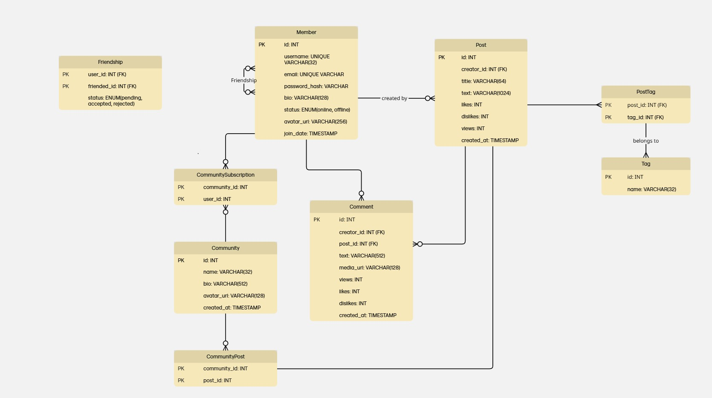

# Ненормалізована форма


# Функціональні залежності

## Member

```
id -> username
id -> password_hash
id -> email
id -> status
id -> bio
id -> avatar_url
id -> join_date
```

## Friendship

```
(user_id, firended_id) -> status
```

## Post 

```
id -> title
id -> text
id -> likes
id -> dislikes
id -> views
id -> created_at
```

## Tag 

```
id -> name 
id -> post_id
```

## Community 

```
id -> name
id -> bio
id -> avatar_url
id -> created_at
```

## CommunitySubscription

```
id -> community_id
id -> user_id
```

## CommunityPost 

```
id -> community_id
id -> post_id
```

## Comment

```
id -> creator_id
id -> post_id
id -> text
id -> media_url
id -> views
id -> likes 
id -> dislikes
id -> created_at
```

# Нормалізована форма



Формально наша база відповідає 3NF. Проте, таблиця Tag потребувала реорганізації, оскільки один пост може мати багато тегів, тому для моделювання зв'язку many-to-many було додано проміжну таблицю PostTag. Також, у таблиці CommunityPost було використано складений ключ для уникнення дублікатів.

# 1NF

Перша нормальна форма вимагає, щоб усі атрибути були атомарними. Наша база данних не порушує цю форму. 

# 2NF

Друга нормальна форма вимагає, щоб усі неключові атрибути не залежили від частини ключа.

# 3NF

Третя нормальна форма вимагає, щоб усі неключові атрибути залежили лише від свого ключа. 
