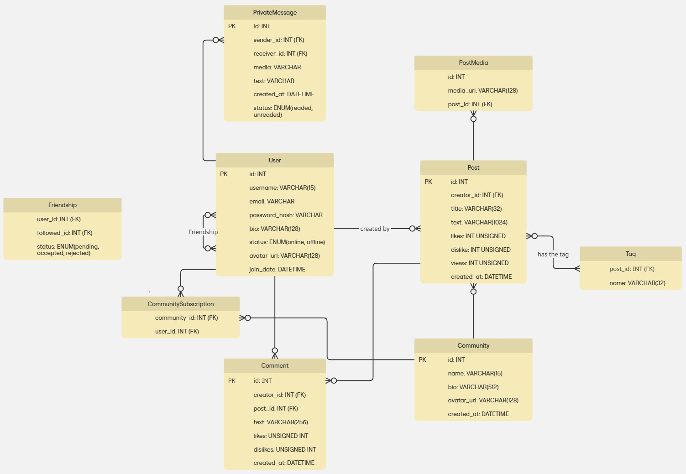

# Work In Progress

## Сутності

### 1. User
- Реєстрація
- Аунтефікація
- Редагування
- Видалення
- Підписатися

### 2. Post
- Створення
- Видалення
- Редагування

### 3. Community
- Підписатися
- Редагувати

### 4. Tag
- Додати до посту

### 5. Messages
- Надіслати користовачу
- Редагувати
- Видалити

### 4. Comment
- Додати під публікацією
- Видалити

### 5. Дружба
- Надіслати запит
- Прийняти запит 
- Відхилити запит

## ER-діаграма

    

