## Сутності

### 1. Member
- Реєстрація
- Автентифікація
- Редагування
- Видалення
- Підписатися

| Поле          | Тип                   | Обмеження                            |
|---------------|-----------------------|--------------------------------------|
| username      | UNIQUE VARCHAR(32)    | Унікальний, без спеціальних символів |
| password_hash | VARCHAR               | Хеш паролю                           |
| email         | UNIQUE VARCHAR        | Унікальний, у форматі пошти          |
| status        | ENUM(online, offline) | Лише 'online' чи 'offline'           |
| bio           | VARCHAR(256)          | ≤ 256 символів                       |
| avatar_url    | VARCHAR(256)          | ≤ 256 символів                       |
| join_date     | TIMESTAMP             |                                      |

### 2. Friendship
- Надіслати запит
- Прийняти запит 
- Відхилити запит
- Видалити з друзів
- Переглядати списки друзів

| Поле          | Тип                                | Обмеження                                | 
|---------------|------------------------------------|------------------------------------------|
| user_id       | INT (Foreign Key)                  |                                          |
| friended_id   | INT (Foreign Key)                  |                                          |
| status        | ENUM(pending, accepted, rejected)  | Лише 'pending' чи 'accepted', 'rejected' |

### 3. Post
- Створення
- Видалення
- Редагування
- Перегляд

| Поле          | Тип                         | Обмеження            |
|---------------|-----------------------------|----------------------|
| creator_id    | INT (Foreign Key)           |                      |
| title         | VARCHAR(64)                 | ≤ 64 символів        |
| text          | VARCHAR(1024)               | ≤ 1024 символів      |
| likes         | INT CHECK (likes >= 0)      | ≥ 0                  |
| dislikes      | INT CHECK (dislikes >= 0)   | ≥ 0                  |
| views         | INT CHECK (views >= 0)      | ≥ 0                  |
| created_at    | TIMESTAMP                   |                      |

### 4. Tag
- Додання до посту
- Видалення з посту

| Поле          | Тип               | Обмеження         | 
|---------------|-------------------|-------------------|
| post_id       | INT (Foreign Key) |                   |
| name          | VARCHAR(32)       | ≤ 32 символів     |

### 5. Community
- Створення
- Видалення
- Підписка
- Редагування bio

| Поле          | Тип                                | Обмеження                            |
|---------------|------------------------------------|--------------------------------------|
| name          | UNIQUE VARCHAR(32)                 | Унікальний, ≤ 32 символів           |
| bio           | VARCHAR(512)                       | ≤ 512 символів                       |
| avatar_url    | VARCHAR(128)                       | Посилання на зображення              |
| created_at    | TIMESTAMP                          |                                      |

### 6. CommunitySubscription
- Підписатися
- Відписатися
- Переглянути підписки

| Поле          | Тип                                | Обмеження              |
|---------------|------------------------------------|------------------------|
| community_id  | INT (Foreign Key)                  |                        |
| user_id       | INT (Foreign Key)                  |                        |

### 7. CommunityPost
- Додати пост
- Видалити пост

| Поле          | Тип                                | Обмеження              |
|---------------|------------------------------------|------------------------|
| community_id  | INT (Foreign Key)                  |                        |
| post_id       | INT (Foreign Key)                  |                        |

### 8. PostMedia
- Додати медіа до посту
- Видалення
- Редагування

| Поле          | Тип                         | Обмеження            |
|---------------|-----------------------------|----------------------|
| post_id       | INT (Foreign Key)           |                      |
| media_url     | VARCHAR(128)                | ≤ 128 символів       |

### 9. PrivateMessage
- Надіслати користувачу
- Редагувати
- Переглянути
- Видалити
- Позначити як прочитане

| Поле          | Тип                    | Обмеження                    | 
|---------------|------------------------|------------------------------|
| sender_id     | INT (Foreign Key)      |                              |
| receiver_id   | INT (Foreign Key)      |                              |
| text          | VARCHAR(512)           | ≤ 512 символів               |
| status        | ENUM(readed, unreaded) | Лише 'readed' чи 'unreaded'  |
| media_url     | VARCHAR(128)           |                              |
| created_at    | TIMESTAMP              |                              |

### 10. Comment
- Додати під публікацією
- Змінити
- Видалити
- Редагувати
- Оцінити (likes/dislikes)

| Поле          | Тип                          | Обмеження              |
|---------------|------------------------------|------------------------|
| creator_id    | INT (Foreign Key)            |                        |
| post_id       | INT (Foreign Key)            |                        |
| text          | VARCHAR(512)                 | ≤ 512 символів         |
| media_url     | VARCHAR(128)                 | ≤ 128 символів         |
| views         | INT CHECK (views >= 0)       | ≥ 0                    |
| likes         | INT CHECK (likes >= 0)       | ≥ 0                    |
| dislikes      | INT CHECK (dislikes >= 0)    | ≥ 0                    |
| created_at    | TIMESTAMP                    |                        |

## Тестування

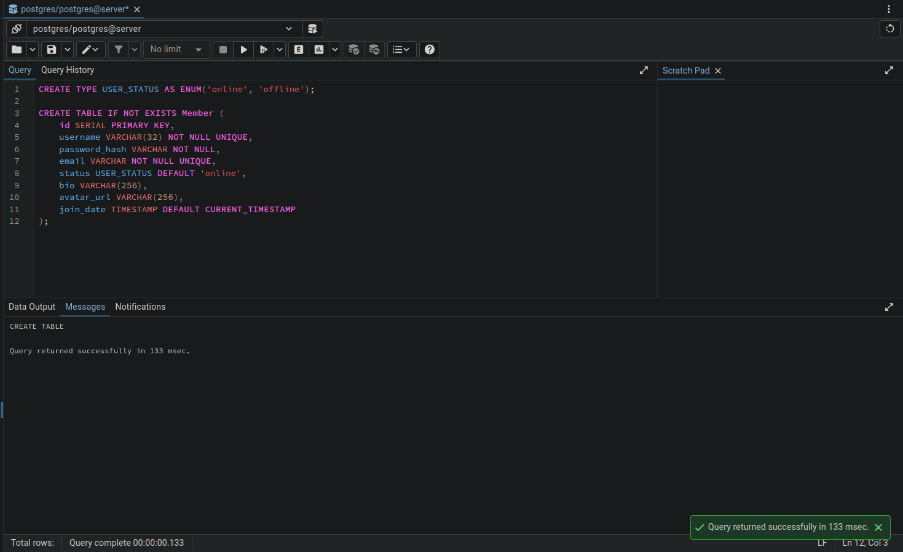
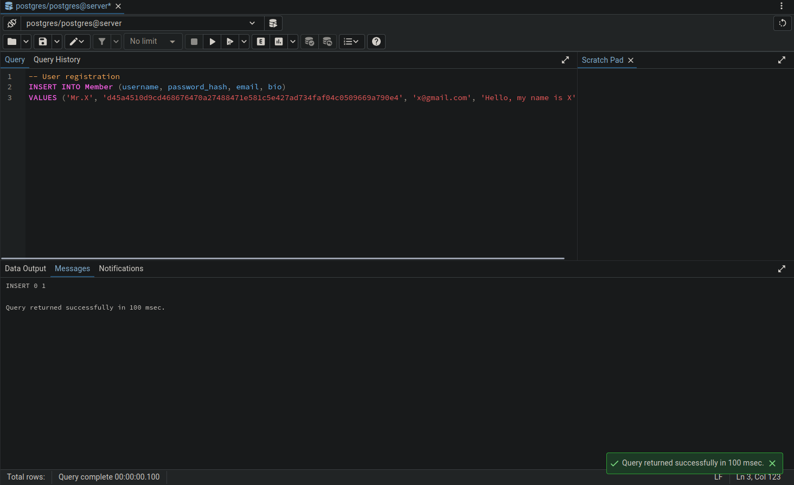
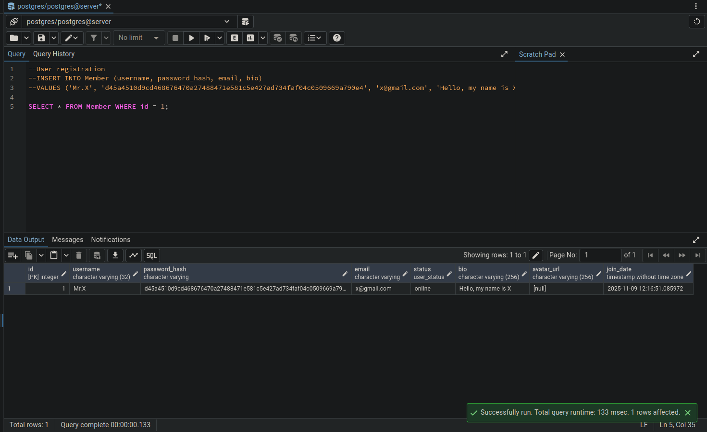
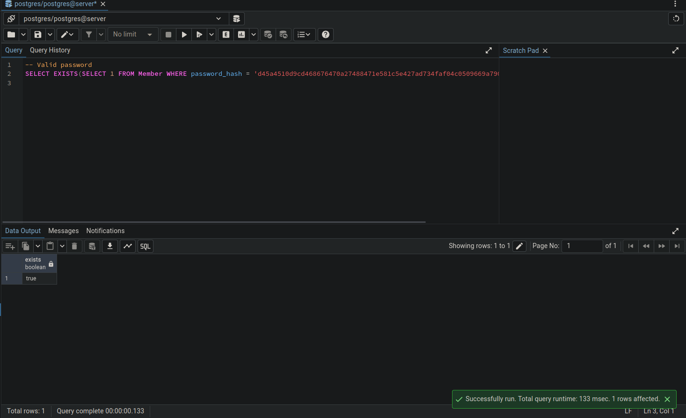
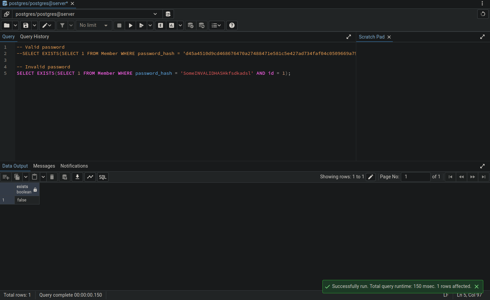
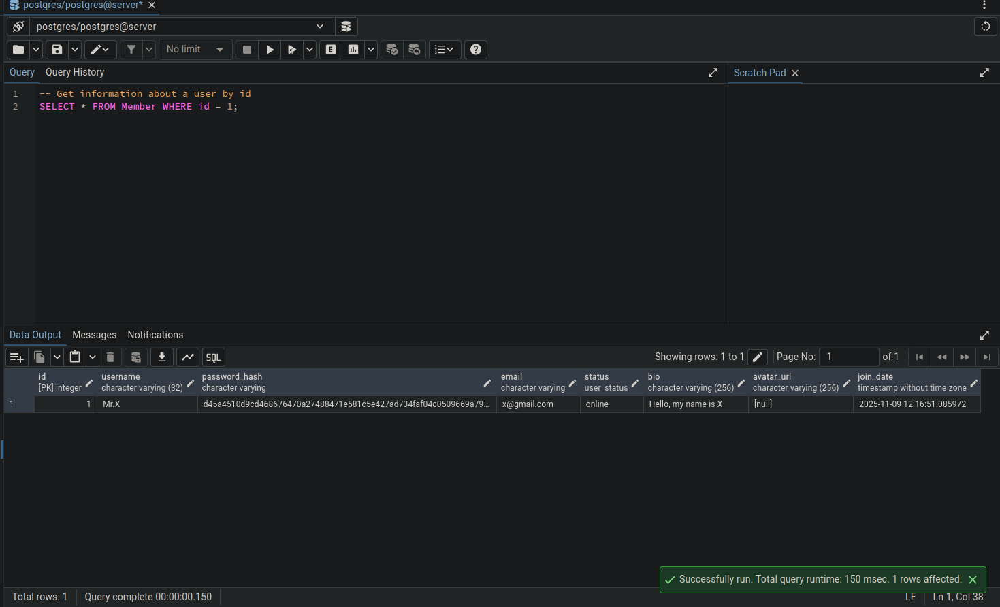
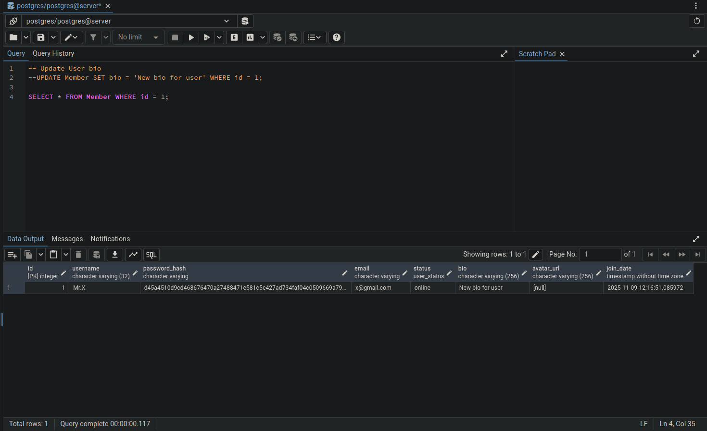

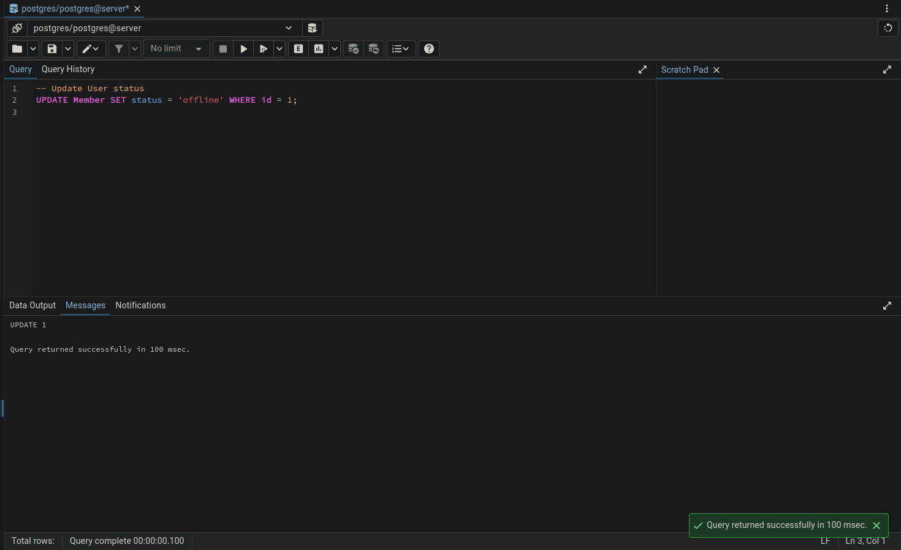
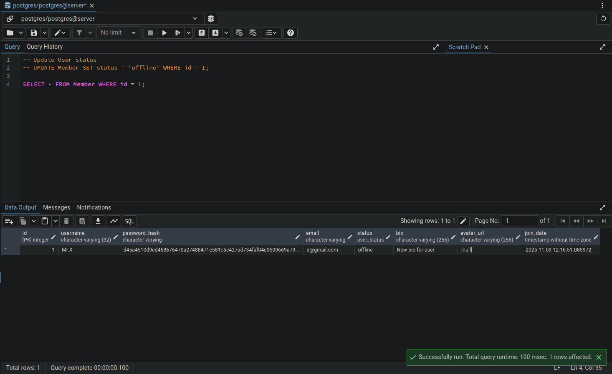
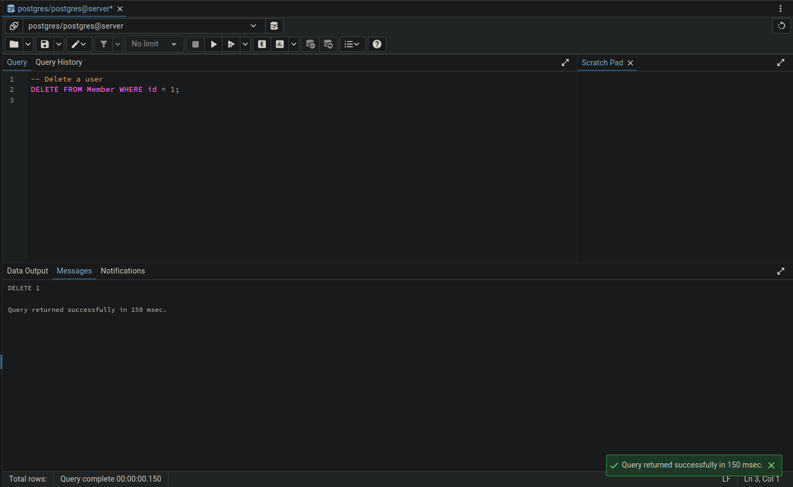
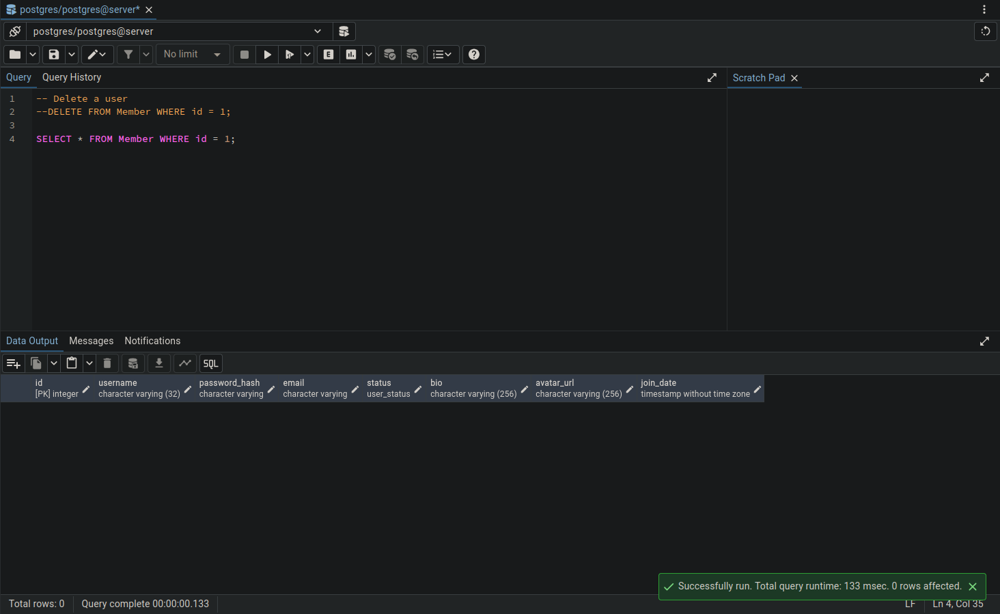

